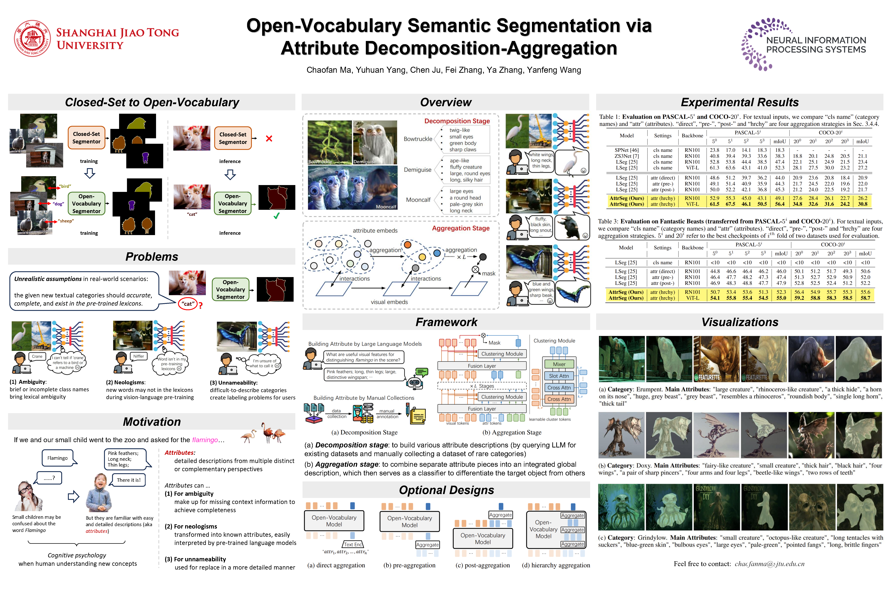

---
dataset_info:
  features:
  - name: image
    dtype: image
  - name: mask
    dtype: image
  - name: category
    dtype: string
  - name: attributes
    sequence: string
task_categories:
- image-segmentation
- zero-shot-image-classification
- object-detection
- image-classification
- image-to-text
- feature-extraction
- other
tags:
- computer-vision
- semantic-segmentation
- open-vocabulary
- open-vocabulary-segmentation
- zero-shot
- zero-shot-learning
- attribute-based
- vision-language
- multimodal
- benchmark
- evaluation
- neologism
- rare-objects
- fantasy
- magical-creatures
- neurips-2023
- attrseg
language:
- en
pretty_name: Fantastic Beasts Dataset
size_categories:
- n<1K
license: mit
---

# Fantastic Beasts Datasets: Benchmark in *AttrSeg: Open-Vocabulary Semantic Segmentation via Attribute Decomposition-Aggregation*

[](https://huggingface.co/datasets/chaofanma/Fantastic-Beasts)
[](https://github.com/chaofanma/AttrSeg)
[](https://arxiv.org/pdf/2309.00096)
[](LICENSE)

**🤗 [View on Hugging Face](https://huggingface.co/datasets/chaofanma/Fantastic-Beasts)** | **💻 [GitHub Repository](https://github.com/chaofanma/AttrSeg)**

This repository contains the collected dataset used in the NeurIPS 2023 paper: AttrSeg: Open-Vocabulary Semantic Segmentation via Attribute Decomposition-Aggregation. [See the paper here](https://arxiv.org/pdf/2309.00096).




## Brief Introduction

Existing datasets often lack the inclusion of rare or obscure vocabulary.
To address this limitation, we manually curated a dataset titled "Fantastic Beasts", which consists of 20 categories of magical creatures from the film series *Fantastic Beasts and Where to Find Them*.
This dataset is designed for comprehensive evaluation and simulating real-world scenarios, specifically for two common situations where attribute descriptions are essential:

**Neologisms**: Vanilla category names represent new vocabularies that are often unseen by large language models (LLMs) and vision-language pre-trainings (VLPs).

**Unnameability**: When users encounter unfamiliar objects, they may struggle to name them, particularly in the case of rare or obscure categories.

For more details, please refer to the [paper](https://arxiv.org/pdf/2309.00096).


## How to Use This Dataset

### Using Hugging Face Datasets

```python
from datasets import load_dataset, Image

# Option 1: Load from Hugging Face Hub
dataset = load_dataset("chaofanma/Fantastic-Beasts", split='test')

# Option 2: Load from local Parquet file
# dataset = load_dataset('parquet', data_files={'test': 'data/test-00000-of-00001.parquet'}, split='test')

# Use the dataset
sample = dataset[0]
image = sample['image']          # PIL Image (embedded in Parquet)
mask = sample['mask']            # PIL Image (embedded in Parquet)
category = sample['category']    # str: "Augurey"
attributes = sample['attributes'] # list of str
```

**Note:** 
- This dataset uses **Parquet format** with embedded images (recommended by Hugging Face)
- Images are stored as binary data within the Parquet file (79.8 MB)
- The file `test-00000-of-00001.parquet` is automatically recognized as the `test` split
- No manual configuration needed for the Dataset Viewer
- Contains 251 samples designed for evaluation and benchmarking

### Alternative: PyTorch Dataset & Raw Images

This Hugging Face repository contains the dataset in **Parquet/Arrow format** for easy loading. 

For alternative formats and implementations, please visit the **[GitHub Repository](https://github.com/chaofanma/AttrSeg)** which includes:
- Custom PyTorch Dataset class (`examples/fantastic_beasts_dataset.py`)
- Source images and masks in original quality (organized by category)
- JSONL metadata files
- Additional example scripts

The `examples/` folder in this repo provides a reference implementation for those who need it.


## Dataset Structure

### Category Names and Attributes
There are 20 categories in Fantastic Beasts dataset, listed as below in alphabetical order:
```
Augurey, Billywig, Chupacabra, Diricawl, Doxy, Erumpent, Fwooper, Graphorn, Grindylow, Kappa, Leucrotta, Matagot, Mooncalf, Murtlap, Nundu, Occamy, Runespoor, Swoopingevil, Thunderbird, Zouwu
```

### Dataset Files

**On Hugging Face Hub:**
- **data/test-00000-of-00001.parquet**: Parquet file with embedded images (79.8 MB, contains all 251 samples)
  - Images and masks stored as binary data (Apache Arrow format)
  - Automatically recognized as `test` split
  - Optimized for streaming and fast loading

**For source images and additional formats (JSONL, PyTorch Dataset), see [GitHub](https://github.com/chaofanma/AttrSeg)**

### Data Fields
- `image`: PIL Image of the magical creature (embedded binary data in Parquet)
- `mask`: PIL Image of binary segmentation mask (embedded binary data in Parquet; 0 for background, 255 for object)
- `category`: Category name (one of 20 magical creature types)
- `attributes`: List of textual attribute descriptions for the category


## Citation
If this dataset is useful for your research, please consider citing:
```
@article{ma2023attrseg,
  title   = {AttrSeg: Open-Vocabulary Semantic Segmentation via Attribute Decomposition-Aggregation},
  author  = {Chaofan Ma and Yuhuan Yang and Chen Ju and Fei Zhang and Ya Zhang and Yanfeng Wang},
  journal = {Thirty-seventh Conference on Neural Information Processing Systems (NeurIPS)},
  year    = {2023}
}
```


## Acknowledgements

We would like to thank the following people for their direct or indirect contributions to the creation of this dataset:
- J.K. Rowling, as the creator of the Wizarding World and the original author of the Harry Potter series, whose work is foundational.
- David Yates, the director of the film, for contributing to its vision and execution.
- David Heyman, the producer of the film, for his pivotal role in bringing the story to the screen.
- The VFX artists and technicians at Framestore and their team leaders, Tim Burke, Christian Manz, and Pablo Grillo, for their incredible work in creating the magical creatures.
- All the Harry Potter fans who support me in creating this dataset.


